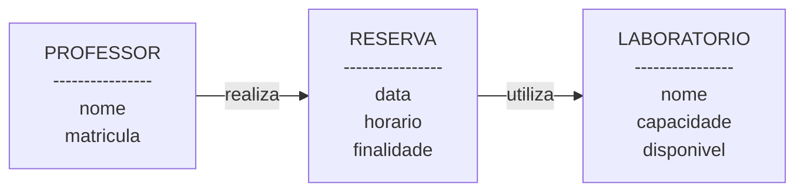

# Diagrama de Classe

```mermaid
flowchart LR
    PROFESSOR["PROFESSOR<br/>----------------<br/>nome<br/>matricula"]

    RESERVA["RESERVA<br/>----------------<br/>data<br/>horario<br/>finalidade"]

    LABORATORIO["LABORATORIO<br/>----------------<br/>nome<br/>capacidade<br/>disponivel"]

    PROFESSOR -->|realiza| RESERVA
    RESERVA -->|utiliza| LABORATORIO
```
